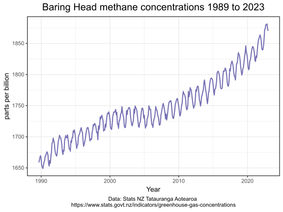
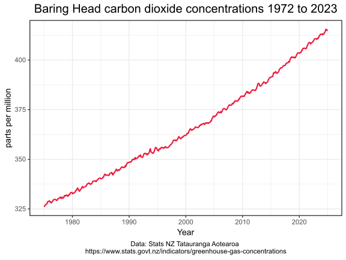

## Methane and nitrous oxide concentrations at Baring Head Wellington New Zealand

Atmospheric carbon dioxide, methane and nitrous oxide concentrations are continuously recorded by the [National Institute of Water and Atmospheric Research](https://en.wikipedia.org/wiki/National_Institute_of_Water_and_Atmospheric_Research) at [Baring Head](https://en.wikipedia.org/wiki/Baring_Head), Wellington, New Zealand.

Statistics NZ Tatauranga Aotearoa (the New Zealand statistics agency) displays these records as indicators at [Greenhouse gas concentrations](https://www.stats.govt.nz/indicators/greenhouse-gas-concentrations) 

This repository lists the R programming language script to download the data, select the gas of interest and to create charts.

This is the methane time series.

This is a chart of the methane data series created using the [Ggplot2](https://ggplot2.tidyverse.org/articles/ggplot2.html) library.

This is the nitrous oxide series.

And this is a chart of the longer running carbon dioxide data series created using the [Ggplot2](https://stackoverflow.com/tags/ggplot2) library.

