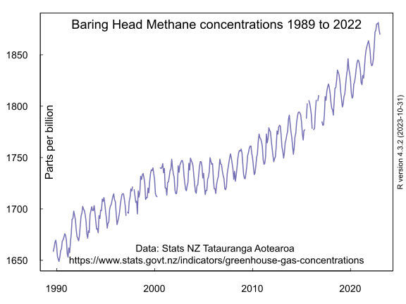
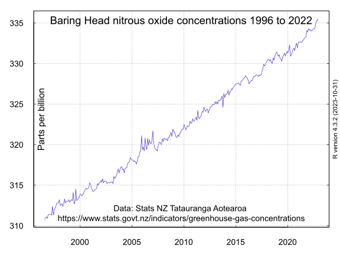

## Methane and nitrous oxide concentrations at Baring Head Wellington New Zealand

Atmospheric carbon dioxide, methane and nitrous oxide concentrations are continuously recorded at [Baring Head](https://en.wikipedia.org/wiki/Baring_Head), Wellington, New Zealand.

Statistics NZ Tatauranga Aotearoa (the New Zealand statistics agency) displays these records as indicators at [Greenhouse gas concentrations] (https://www.stats.govt.nz/indicators/greenhouse-gas-concentrations) 

This repository lists the R programming language script to download the data, select the gas of interest and to create charts.

